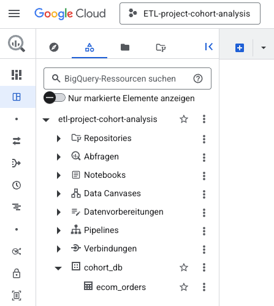
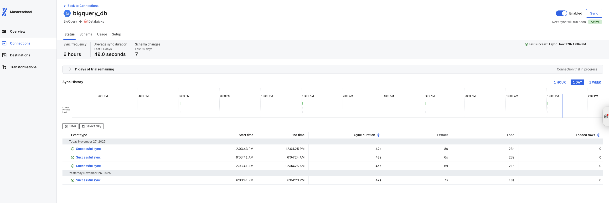
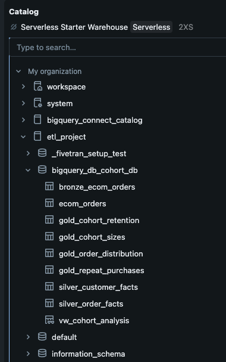
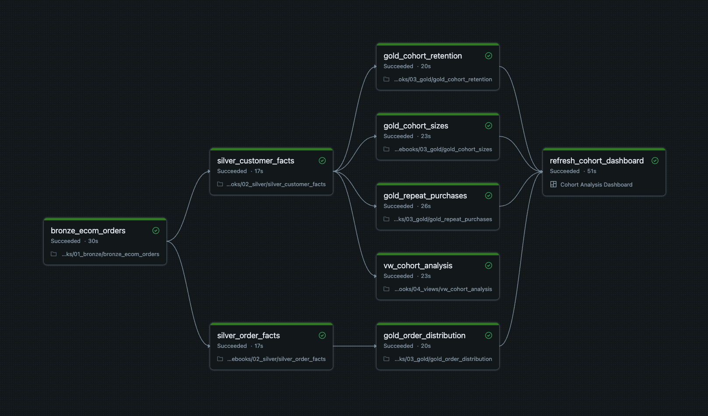

# Cohort Retention Modeling & Customer Behavior Analysis (Ecom Case Study)

**Analyzing customer retention, repeat purchasing, and cohort performance for an e-commerce business**  
*A cloud-native ELT pipeline using BigQuery, Fivetran, and Databricks to model acquisition, retention, and lifecycle purchasing behavior.*

## 📌 Executive Summary

Cohort analysis is one of the most effective ways to understand how customer behavior evolves over time — particularly in e-commerce, where acquisition and retention directly drive revenue.  
It helps answer essential business questions:

- **How effectively are we acquiring new customers?**  
- **Do first-time buyers return — and how quickly?**  
- **Which monthly cohorts perform better or worse?**  
- **Is retention improving or declining over time?**

This project simulates a real-world analytics pipeline for a fictitious online shop (2024).  
While Databricks refers to the Unity Catalog as *ETL*, the actual workflow is modern **ELT** (data is loaded first, then transformed entirely in Databricks).  
Using cloud-native ELT tools (**BigQuery → Fivetran → Databricks**), the pipeline produces insights into:

- Monthly cohort sizes  
- Retention after 1, 2, and 3 months  
- Depth of repeat purchasing  
- Contribution of new vs. existing customers over time  

The entire workflow follows the **Medallion Architecture** (Bronze → Silver → Gold → Serve Layer) and ends in an **interactive Databricks Lakeview dashboard**.

---

## 🚀 Architecture Overview (ELT Workflow)

```text
BigQuery (Source)
        │
        ▼
Fivetran (Managed Connector) — Extract & Load
        │
        ▼
Databricks Lakehouse — Transform
 ├── Bronze  – Raw ingested tables
 ├── Silver  – Clean business facts
 ├── Gold    – Analytics-ready tables
 └── Serve   – Lakeview Dashboard
```

---

## 1. Data Source – BigQuery

The raw dataset `ecom_orders` contains ~1,000 transactions from a fictitious e-commerce store for the year 2024.

### ✔ BigQuery Dataset



---

## 2. Ingestion Layer – Fivetran

A **Fivetran BigQuery → Databricks** connector loads the `ecom_orders` table into the Lakehouse on an automated schedule.

### Key properties

- Fully managed ingestion (API changes, schema drift, retries, rate limits, incremental loading)  
- Automated scheduled sync  
- Data loaded into Databricks Unity Catalog as Delta tables

### ✔ Fivetran Connector



---

## 3. Databricks Lakehouse – Medallion Architecture

Transformations follow the **Medallion Architecture** described in the Architecture Overview above.
The section below lists the concrete tables implemented in each layer.

---

### 🥉 Bronze Layer – Raw & Cleaned Source

| Table                | Description |
|----------------------|-------------|
| `ecom_orders`        | Raw Fivetran-loaded table including ingestion metadata. |
| `bronze_ecom_orders` | Cleaned subset containing only business-relevant fields (order, customer, date, sales). |

---

### 🥈 Silver Layer – Business Facts

| Table                   | Description |
|-------------------------|-------------|
| `silver_customer_facts` | Customer-level facts: first purchase, cohort month, second purchase, time-to-second-order. |
| `silver_order_facts`    | Order-level facts enriched with lifecycle tagging (new/existing) and monthly features. |

---

### 🥇 Gold Layer – Analytics Marts

| Table                     | Description |
|--------------------------|-------------|
| `gold_cohort_sizes`      | Customers per cohort month |
| `gold_cohort_retention`  | 1-, 2-, and 3-month retention |
| `gold_repeat_purchases`  | Share reaching 2+, 3+, 4+ orders |
| `gold_order_distribution`| Monthly orders by new vs. existing customers |

---

## 📁 Databricks Unity Catalog Structure

All tables are stored inside Unity Catalog.

### ✔ Unity Catalog



---

## 4. Pipeline Orchestration – Databricks Jobs

The full pipeline runs as a Databricks job with:

- Bronze → Silver → Gold → Dashboard dependency chain  
- Triggered by **Table Update** of `ecom_orders`  
- Serverless compute  
- Automated dashboard refresh
- Email notifications (on start, success, and failure – including a snapshot of the refreshed cohort dashboard after a successful run)

### ✔ Successful DAG Run



---

## 5. Serve Layer – Cohort Analysis Dashboard

The final dashboard highlights key e-commerce KPIs:

### 📊 Metrics

- Monthly order volume (new vs. existing customers)
- Cohort sizes
- Retention after 1/2/3 months
- Repeat purchase depth (2+, 3+, 4+ orders)

### 🔍 Insights (2024)

- **Customer acquisition declines sharply from February** and stops entirely after June.  
- **Early retention (1-month) peaks in Apr/May**, but declines overall, whereas **longer-term retention (2–3 months) remains stable**, indicating consistent return behavior across cohorts.
- **Repeat purchase depth weakens** — while most customers place a second order, fewer continue to a third or fourth purchase.

Overall → **declining acquisition and weakening early repeat behavior indicate decreasing activation effectiveness across 2024**

### ✔ Dashboard Screenshot


---

## 6. Repository Structure

```text
ETL-Project-Cohort-Analysis/
│
├── notebooks/
│   ├── 01_bronze/
│   ├── 02_silver/
│   ├── 03_gold/
│   ├── 04_views/
│   └── 90_inspect/
│
├── img/
│   ├── source_bigquery.png
│   ├── connector_fivetran.png
│   ├── databricks_catalog.png
│   ├── databricks_dag.png
│   └── cohort_dashboard.png
│
└── README.md
```

---

## 7. Technologies Used

- **Google BigQuery** – cloud data warehouse used as the source system  
- **Fivetran** – fully managed connector for automated, incremental data ingestion  
- **Databricks Lakehouse** – Delta Lake storage, SQL & PySpark transformations, Jobs orchestration, Lakeview dashboards  
- **GitHub** – version control and documentation

---

## 8. How to Reproduce

1. **Set up BigQuery**  
   Create a dataset and load the sample `ecom_orders` table.

2. **Configure Fivetran**  
   Connect BigQuery → Databricks using the managed connector.

3. **Prepare Databricks**  
   Create a catalog & schema to store Bronze, Silver, and Gold tables.

4. **Connect Databricks to GitHub**  
   Create a project repo, link it as a Databricks Repo, and sync notebooks via Git.

5. **Run the transformation notebooks**  
   Execute Bronze → Silver → Gold notebooks to build the Medallion tables.

6. **Validate the tables**  
   Use the inspection notebook to preview Bronze/Silver/Gold outputs before orchestration.

7. **Create the Databricks Job**  
   Orchestrate Bronze → Silver → Gold using a table-update trigger.

8. **Build the Lakeview dashboard**  
   Visualize cohort sizes, retention, and repeat purchases.

---

## 9. Next Steps (Extension Options)

Given the limited sample dataset, meaningful improvements include:

- Add product, channel, or demographic dimensions  
- Introduce dbt for modular modeling & testing  
- Add data quality expectations  
- Publish dashboard externally (Tableau / Power BI)  
- Parameterize the pipeline for multiple datasets  

---

## 🧑‍💻 Author

**Thomas Jortzig**  
Cohort Retention Modeling & Customer Behavior Analysis – Ecom Case Study (11/2025)
